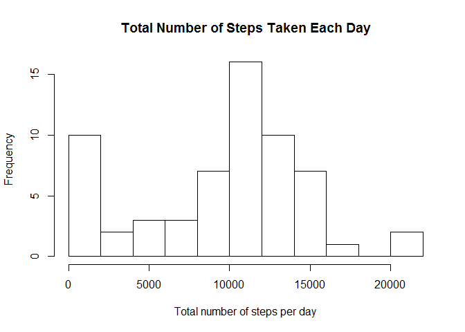
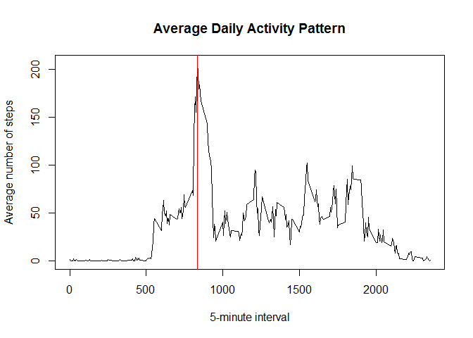
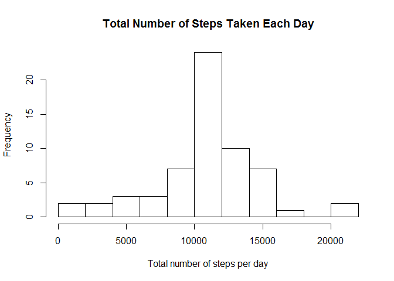
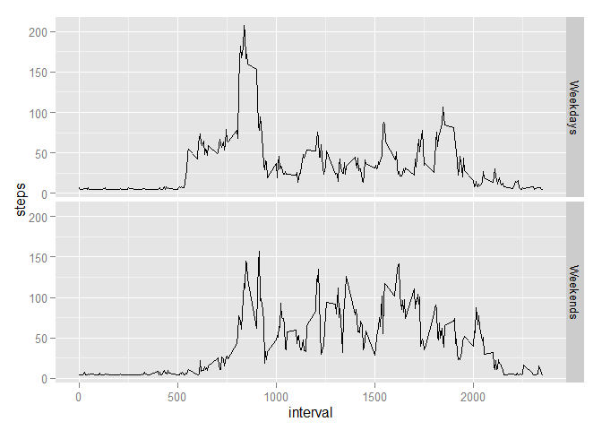

# Reproducible Research: Peer Assessment 1


## Loading and preprocessing the data
Data was loaded from working directory using "read.csv" function

```r
dat <- read.csv("activity.csv", header=TRUE)
```


```
## [1] "English_United States.1252"
```


## What is mean total number of steps taken per day?

Calculated the total number of steps taken per day

```r
library(dplyr)
dat2 <- group_by(dat, date)
totalstep <- summarise(dat2, steps = sum(steps, na.rm = TRUE))
```

And below is the histogram of the total number of steps taken each day

```r
hist(totalstep$steps, xlab = "Total number of steps per day", main = "Total Number of Steps Taken Each Day", breaks = 10)
```

 

Calculated the mean and median of the total number of steps taken per day

```r
mean(totalstep$steps)
```

```
## [1] 9354.23
```

```r
median(totalstep$steps)
```

```
## [1] 10395
```


## What is the average daily activity pattern?

The graph below shows a time series plot of the 5-minute interval (x-axis) and the average number of steps taken, averaged across all days (y-axis)

```r
dat3 <- group_by(dat, interval)
intervalstep <- summarise(dat3, steps = mean(steps, na.rm = TRUE))
with(intervalstep, plot(intervalstep$interval, intervalstep$steps, type = "l",
                        main = "Average Daily Activity Pattern", xlab = "5-minute interval",
                        ylab = "Average number of steps"))
abline(v = intervalstep[which.max(intervalstep$steps),1], col = "red")
```

 

The 5-minute interval which contains the maximum number of steps are shown below

```r
intervalstep[which.max(intervalstep$steps),1]
```

```
## Source: local data frame [1 x 1]
## 
##   interval
## 1      835
```
It's 835


## Imputing missing values

This is the total number of NA's in this dataset

```r
sum(is.na(dat))
```

```
## [1] 2304
```

I chose to fill in NA's with "median steps"" of the day.

Median steps of the day was 10395, and there were 288 intervals per day.
10395/288 is about 36.

So I filled every NA's with 36

```r
fdat <- dat
fdat[is.na(fdat)] <- 36
```

This is a histogram of the total number of steps taken each day with new data frame

```r
fdat2 <- group_by(fdat, date)
ftotalstep <- summarise(fdat2, steps = sum(steps, na.rm = TRUE))
hist(ftotalstep$steps, xlab = "Total number of steps per day", main = "Total Number of Steps Taken Each Day", breaks = 10)
```

 

Calculated the mean and median of the total number of steps taken per day with new data frame

```r
mean(ftotalstep$steps)
```

```
## [1] 10713.97
```

```r
median(ftotalstep$steps)
```

```
## [1] 10395
```

Compared to first part of the assignment, average was slightly increased but median was same.

Imputing missing data on the estimates of the total daily number of steps reduces variance.


## Are there differences in activity patterns between weekdays and weekends?

I created a new factor variable in the dataset with two levels -- "weekday" and "weekend" indicating whether a given date is a weekday or weekend day.

```r
fdat$date <- as.Date(fdat$date)
weekdays <- weekdays(fdat$date)
fdat2 <- cbind(fdat, weekdays)
fdat2$weekdays <- as.character(fdat2$weekdays)
fdat2$weekdays[fdat2$weekdays %in% c("Monday","Tuesday", "Wednesday", "Thursday", "Friday")] <- "Weekdays"
fdat2$weekdays[fdat2$weekdays %in% c("Sunday","Saturday")] <- "Weekends"
```

Made a panel plot containing a time series plot of the 5-minute interval (x-axis) and the average number of steps taken, averaged across all weekday days or weekend days (y-axis). 


```r
fdat3 <- group_by(fdat2, interval, weekdays)
fintervalstep <- summarise(fdat3, steps = mean(steps, na.rm = TRUE))
library(ggplot2)
qplot(interval, steps, data = fintervalstep, geom = "line", facets = weekdays~.)
```

 
